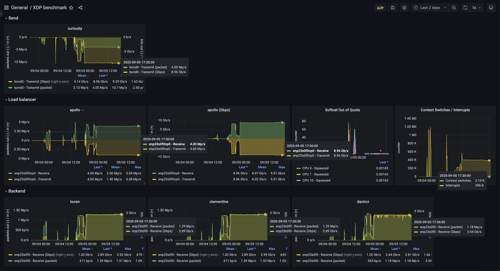
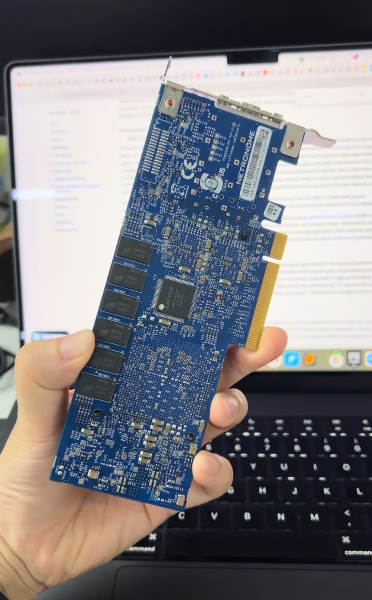

# UDP Load Balancer using XDP

**This work is just for fun and still in progress ...*




## Key features

- Load balance UDP packets to multiple backends (configurable destination IP and Port)
- Prometheus exporter metrics
- Carefully tested at 4 million, 280-byte packets per second (4Mpps, 9Gbps) using enterprise-grade network devices (`Cisco Nexus 92160YC-X` for packet switching).

- Tested by `nc`, `hping3`, and a `kernel-level packet generator`

Note 1: To save CPU workload, this load balancer does not recalculate UDP payload checksum when modifying destination ports.

Note 2: Debugging techniques, kernel tuning parameters, NIC parameters, and hardware specs are not included in this repo. If you can not reach 4Mpps, it's not about the code :D

## Getting started

- Step 1: Prepare a Ubuntu 24.04 or Rocky 9 machine
- Step 2: Install bcc at [https://github.com/iovisor/bcc](https://github.com/iovisor/bcc)
- Step 3: `pip install -r requirements.txt`
- Step 4: Update `config.py`
- Step 5: `python xdb_lb.py`

Sample application log

```
/root/ebpf-dev/venv/bin/python /root/ebpf-dev/xdp_lb.py 
[2025-09-06 06:09:09,352] [server.py:84] [INFO] Started server process [1259609]
[2025-09-06 06:09:09,353] [on.py:48] [INFO] Waiting for application startup.
[2025-09-06 06:09:09,353] [xdp_lb.py:72] [INFO] Trying to load XDP program in mode XDP_FLAGS_DRV_MODE ...
[2025-09-06 06:09:09,682] [xdp_lb.py:75] [INFO] XDP program loaded in 328.96 ms
[2025-09-06 06:09:09,682] [config.py:29] [INFO] Backend 172.30.30.21:5555 via mac [0xAC, 0x1F, 0x6B, 0x34, 0xBC, 0xD8]
[2025-09-06 06:09:09,683] [config.py:29] [INFO] Backend 172.30.30.22:5555 via mac [0xAC, 0x1F, 0x6B, 0x34, 0x85, 0x88]
[2025-09-06 06:09:09,683] [config.py:29] [INFO] Backend 172.30.30.23:5555 via mac [0xAA, 0x59, 0xCE, 0x90, 0xFC, 0xFE]
[2025-09-06 06:09:09,683] [xdp_lb.py:97] [INFO] Max CPUs: 40
[2025-09-06 06:09:09,683] [xdp_lb.py:99] [INFO] Filter destination: 172.30.30.20:5000
[2025-09-06 06:09:09,683] [xdp_lb.py:99] [INFO] Filter destination: 172.30.30.20:5001
[2025-09-06 06:09:09,683] [xdp_lb.py:99] [INFO] Filter destination: 172.30.30.20:5002
[2025-09-06 06:09:09,683] [xdp_lb.py:99] [INFO] Filter destination: 172.30.30.20:5003
[2025-09-06 06:09:09,683] [xdp_lb.py:99] [INFO] Filter destination: 172.30.30.20:5004
[2025-09-06 06:09:09,683] [xdp_lb.py:99] [INFO] Filter destination: 172.30.30.20:5005
[2025-09-06 06:09:09,684] [xdp_lb.py:111] [INFO] Listening on enp23s0f0np0 ...
[2025-09-06 06:09:09,685] [xdp_lb.py:116] [INFO] ✅ Server has started up!
[2025-09-06 06:09:09,685] [on.py:62] [INFO] Application startup complete.
[2025-09-06 06:09:09,685] [server.py:216] [INFO] Uvicorn running on http://0.0.0.0:8000 (Press CTRL+C to quit)
```

## Sample metrics

```
curl -s 127.0.0.1:8000/metrics
# HELP xdp_packet_processed_rate Instant processed packets per second
# TYPE xdp_packet_processed_rate gauge
xdp_packet_processed_rate{cpu="total",host="apollo",interface="enp23s0f0np0"} 7.794713e+06
xdp_packet_processed_rate{cpu="0",host="apollo",interface="enp23s0f0np0"} 599680.0
xdp_packet_processed_rate{cpu="1",host="apollo",interface="enp23s0f0np0"} 799557.0
xdp_packet_processed_rate{cpu="2",host="apollo",interface="enp23s0f0np0"} 0.0
xdp_packet_processed_rate{cpu="3",host="apollo",interface="enp23s0f0np0"} 0.0
xdp_packet_processed_rate{cpu="4",host="apollo",interface="enp23s0f0np0"} 799591.0
xdp_packet_processed_rate{cpu="5",host="apollo",interface="enp23s0f0np0"} 799577.0
xdp_packet_processed_rate{cpu="6",host="apollo",interface="enp23s0f0np0"} 0.0
xdp_packet_processed_rate{cpu="7",host="apollo",interface="enp23s0f0np0"} 799482.0
xdp_packet_processed_rate{cpu="8",host="apollo",interface="enp23s0f0np0"} 799568.0
xdp_packet_processed_rate{cpu="9",host="apollo",interface="enp23s0f0np0"} 799564.0
xdp_packet_processed_rate{cpu="10",host="apollo",interface="enp23s0f0np0"} 0.0
xdp_packet_processed_rate{cpu="11",host="apollo",interface="enp23s0f0np0"} 0.0
xdp_packet_processed_rate{cpu="12",host="apollo",interface="enp23s0f0np0"} 798037.0
xdp_packet_processed_rate{cpu="13",host="apollo",interface="enp23s0f0np0"} 799572.0
xdp_packet_processed_rate{cpu="14",host="apollo",interface="enp23s0f0np0"} 0.0
xdp_packet_processed_rate{cpu="15",host="apollo",interface="enp23s0f0np0"} 800085.0
xdp_packet_processed_rate{cpu="16",host="apollo",interface="enp23s0f0np0"} 0.0
xdp_packet_processed_rate{cpu="17",host="apollo",interface="enp23s0f0np0"} 0.0
xdp_packet_processed_rate{cpu="18",host="apollo",interface="enp23s0f0np0"} 0.0
xdp_packet_processed_rate{cpu="19",host="apollo",interface="enp23s0f0np0"} 0.0
xdp_packet_processed_rate{cpu="20",host="apollo",interface="enp23s0f0np0"} 0.0
xdp_packet_processed_rate{cpu="21",host="apollo",interface="enp23s0f0np0"} 0.0
xdp_packet_processed_rate{cpu="22",host="apollo",interface="enp23s0f0np0"} 0.0
xdp_packet_processed_rate{cpu="23",host="apollo",interface="enp23s0f0np0"} 0.0
xdp_packet_processed_rate{cpu="24",host="apollo",interface="enp23s0f0np0"} 0.0
xdp_packet_processed_rate{cpu="25",host="apollo",interface="enp23s0f0np0"} 0.0
xdp_packet_processed_rate{cpu="26",host="apollo",interface="enp23s0f0np0"} 0.0
xdp_packet_processed_rate{cpu="27",host="apollo",interface="enp23s0f0np0"} 0.0
xdp_packet_processed_rate{cpu="28",host="apollo",interface="enp23s0f0np0"} 0.0
xdp_packet_processed_rate{cpu="29",host="apollo",interface="enp23s0f0np0"} 0.0
xdp_packet_processed_rate{cpu="30",host="apollo",interface="enp23s0f0np0"} 0.0
xdp_packet_processed_rate{cpu="31",host="apollo",interface="enp23s0f0np0"} 0.0
xdp_packet_processed_rate{cpu="32",host="apollo",interface="enp23s0f0np0"} 0.0
xdp_packet_processed_rate{cpu="33",host="apollo",interface="enp23s0f0np0"} 0.0
xdp_packet_processed_rate{cpu="34",host="apollo",interface="enp23s0f0np0"} 0.0
xdp_packet_processed_rate{cpu="35",host="apollo",interface="enp23s0f0np0"} 0.0
xdp_packet_processed_rate{cpu="36",host="apollo",interface="enp23s0f0np0"} 0.0
xdp_packet_processed_rate{cpu="37",host="apollo",interface="enp23s0f0np0"} 0.0
xdp_packet_processed_rate{cpu="38",host="apollo",interface="enp23s0f0np0"} 0.0
xdp_packet_processed_rate{cpu="39",host="apollo",interface="enp23s0f0np0"} 0.0
# HELP xdp_packet_processed Packets processed
# TYPE xdp_packet_processed gauge
xdp_packet_processed{cpu="total",host="apollo",interface="enp23s0f0np0"} 2.34771478829e+011
xdp_packet_processed{cpu="0",host="apollo",interface="enp23s0f0np0"} 1.8059367566e+010
xdp_packet_processed{cpu="1",host="apollo",interface="enp23s0f0np0"} 2.4079161089e+010
xdp_packet_processed{cpu="2",host="apollo",interface="enp23s0f0np0"} 0.0
xdp_packet_processed{cpu="3",host="apollo",interface="enp23s0f0np0"} 0.0
xdp_packet_processed{cpu="4",host="apollo",interface="enp23s0f0np0"} 2.4079114831e+010
xdp_packet_processed{cpu="5",host="apollo",interface="enp23s0f0np0"} 2.4079080261e+010
xdp_packet_processed{cpu="6",host="apollo",interface="enp23s0f0np0"} 0.0
xdp_packet_processed{cpu="7",host="apollo",interface="enp23s0f0np0"} 2.4079174631e+010
xdp_packet_processed{cpu="8",host="apollo",interface="enp23s0f0np0"} 2.4079119313e+010
xdp_packet_processed{cpu="9",host="apollo",interface="enp23s0f0np0"} 2.4079145937e+010
xdp_packet_processed{cpu="10",host="apollo",interface="enp23s0f0np0"} 0.0
xdp_packet_processed{cpu="11",host="apollo",interface="enp23s0f0np0"} 0.0
xdp_packet_processed{cpu="12",host="apollo",interface="enp23s0f0np0"} 2.4079082523e+010
xdp_packet_processed{cpu="13",host="apollo",interface="enp23s0f0np0"} 2.4079098612e+010
xdp_packet_processed{cpu="14",host="apollo",interface="enp23s0f0np0"} 0.0
xdp_packet_processed{cpu="15",host="apollo",interface="enp23s0f0np0"} 2.4079134066e+010
xdp_packet_processed{cpu="16",host="apollo",interface="enp23s0f0np0"} 0.0
xdp_packet_processed{cpu="17",host="apollo",interface="enp23s0f0np0"} 0.0
xdp_packet_processed{cpu="18",host="apollo",interface="enp23s0f0np0"} 0.0
xdp_packet_processed{cpu="19",host="apollo",interface="enp23s0f0np0"} 0.0
xdp_packet_processed{cpu="20",host="apollo",interface="enp23s0f0np0"} 0.0
xdp_packet_processed{cpu="21",host="apollo",interface="enp23s0f0np0"} 0.0
xdp_packet_processed{cpu="22",host="apollo",interface="enp23s0f0np0"} 0.0
xdp_packet_processed{cpu="23",host="apollo",interface="enp23s0f0np0"} 0.0
xdp_packet_processed{cpu="24",host="apollo",interface="enp23s0f0np0"} 0.0
xdp_packet_processed{cpu="25",host="apollo",interface="enp23s0f0np0"} 0.0
xdp_packet_processed{cpu="26",host="apollo",interface="enp23s0f0np0"} 0.0
xdp_packet_processed{cpu="27",host="apollo",interface="enp23s0f0np0"} 0.0
xdp_packet_processed{cpu="28",host="apollo",interface="enp23s0f0np0"} 0.0
xdp_packet_processed{cpu="29",host="apollo",interface="enp23s0f0np0"} 0.0
xdp_packet_processed{cpu="30",host="apollo",interface="enp23s0f0np0"} 0.0
xdp_packet_processed{cpu="31",host="apollo",interface="enp23s0f0np0"} 0.0
xdp_packet_processed{cpu="32",host="apollo",interface="enp23s0f0np0"} 0.0
xdp_packet_processed{cpu="33",host="apollo",interface="enp23s0f0np0"} 0.0
xdp_packet_processed{cpu="34",host="apollo",interface="enp23s0f0np0"} 0.0
xdp_packet_processed{cpu="35",host="apollo",interface="enp23s0f0np0"} 0.0
xdp_packet_processed{cpu="36",host="apollo",interface="enp23s0f0np0"} 0.0
xdp_packet_processed{cpu="37",host="apollo",interface="enp23s0f0np0"} 0.0
xdp_packet_processed{cpu="38",host="apollo",interface="enp23s0f0np0"} 0.0
xdp_packet_processed{cpu="39",host="apollo",interface="enp23s0f0np0"} 0.0
# HELP xdp_packet_latency_ns Packets processing latency in nanoseconds
# TYPE xdp_packet_latency_ns gauge
xdp_packet_latency_ns{host="apollo",interface="enp23s0f0np0",type="mean"} 169.01361620057858
xdp_packet_latency_ns{host="apollo",interface="enp23s0f0np0",type="min"} 110.0
xdp_packet_latency_ns{host="apollo",interface="enp23s0f0np0",type="max"} 3339.0
xdp_packet_latency_ns{host="apollo",interface="enp23s0f0np0",type="std"} 80.17449585541202
xdp_packet_latency_ns{host="apollo",interface="enp23s0f0np0",type="p25"} 123.0
xdp_packet_latency_ns{host="apollo",interface="enp23s0f0np0",type="p50"} 136.0
xdp_packet_latency_ns{host="apollo",interface="enp23s0f0np0",type="p90"} 244.0
xdp_packet_latency_ns{host="apollo",interface="enp23s0f0np0",type="p95"} 280.0
xdp_packet_latency_ns{host="apollo",interface="enp23s0f0np0",type="p99"} 557.0
# HELP interfaces_stat Interface runtime stats
# TYPE interfaces_stat gauge
interfaces_stat{host="apollo",interface="enp23s0f0np0",type="rx_packets"} 2.34776143182e+011
interfaces_stat{host="apollo",interface="enp23s0f0np0",type="tx_packets"} 2.34763405808e+011
interfaces_stat{host="apollo",interface="enp23s0f0np0",type="rx_bytes"} 3.9911925298647e+013
interfaces_stat{host="apollo",interface="enp23s0f0np0",type="tx_bytes"} 3.9910424227473e+013
interfaces_stat{host="apollo",interface="enp23s0f0np0",type="rx_errors"} 0.0
interfaces_stat{host="apollo",interface="enp23s0f0np0",type="tx_errors"} 0.0
interfaces_stat{host="apollo",interface="enp23s0f0np0",type="rx_dropped"} 7.0
interfaces_stat{host="apollo",interface="enp23s0f0np0",type="tx_dropped"} 4.37694051e+08
interfaces_stat{host="apollo",interface="enp23s0f0np0",type="multicast"} 19055.0
interfaces_stat{host="apollo",interface="enp23s0f0np0",type="collisions"} 0.0
interfaces_stat{host="apollo",interface="enp23s0f0np0",type="rx_length_errors"} 0.0
interfaces_stat{host="apollo",interface="enp23s0f0np0",type="rx_over_errors"} 0.0
interfaces_stat{host="apollo",interface="enp23s0f0np0",type="rx_crc_errors"} 0.0
interfaces_stat{host="apollo",interface="enp23s0f0np0",type="rx_frame_errors"} 0.0
interfaces_stat{host="apollo",interface="enp23s0f0np0",type="rx_fifo_errors"} 0.0
interfaces_stat{host="apollo",interface="enp23s0f0np0",type="rx_missed_errors"} 0.0
interfaces_stat{host="apollo",interface="enp23s0f0np0",type="tx_aborted_errors"} 0.0
interfaces_stat{host="apollo",interface="enp23s0f0np0",type="tx_carrier_errors"} 0.0
interfaces_stat{host="apollo",interface="enp23s0f0np0",type="tx_fifo_errors"} 0.0
interfaces_stat{host="apollo",interface="enp23s0f0np0",type="tx_heartbeat_errors"} 0.0
interfaces_stat{host="apollo",interface="enp23s0f0np0",type="tx_window_errors"} 0.0
interfaces_stat{host="apollo",interface="enp23s0f0np0",type="rx_compressed"} 0.0
interfaces_stat{host="apollo",interface="enp23s0f0np0",type="tx_compressed"} 0.0
interfaces_stat{host="apollo",interface="enp23s0f0np0",type="num_tx_queue"} 64.0
interfaces_stat{host="apollo",interface="enp23s0f0np0",type="num_rx_queue"} 64.0
interfaces_stat{host="apollo",interface="enp23s0f0np0",type="mtu"} 1500.0
# HELP interfaces_spec Interface specifications
# TYPE interfaces_spec gauge
interfaces_spec{host="apollo",interface="enp23s0f0np0",type="dummy"} 65672.0
interfaces_spec{host="apollo",interface="enp23s0f0np0",type="forwarding"} 1.0
interfaces_spec{host="apollo",interface="enp23s0f0np0",type="mc_forwarding"} 0.0
interfaces_spec{host="apollo",interface="enp23s0f0np0",type="proxy_arp"} 0.0
interfaces_spec{host="apollo",interface="enp23s0f0np0",type="accept_redirects"} 1.0
interfaces_spec{host="apollo",interface="enp23s0f0np0",type="secure_redirects"} 1.0
interfaces_spec{host="apollo",interface="enp23s0f0np0",type="send_redirects"} 1.0
interfaces_spec{host="apollo",interface="enp23s0f0np0",type="shared_media"} 1.0
interfaces_spec{host="apollo",interface="enp23s0f0np0",type="rp_filter"} 2.0
interfaces_spec{host="apollo",interface="enp23s0f0np0",type="accept_source_route"} 1.0
interfaces_spec{host="apollo",interface="enp23s0f0np0",type="bootp_relay"} 0.0
interfaces_spec{host="apollo",interface="enp23s0f0np0",type="log_martians"} 0.0
interfaces_spec{host="apollo",interface="enp23s0f0np0",type="tag"} 0.0
interfaces_spec{host="apollo",interface="enp23s0f0np0",type="arpfilter"} 0.0
interfaces_spec{host="apollo",interface="enp23s0f0np0",type="medium_id"} 0.0
interfaces_spec{host="apollo",interface="enp23s0f0np0",type="noxfrm"} 0.0
interfaces_spec{host="apollo",interface="enp23s0f0np0",type="nopolicy"} 0.0
interfaces_spec{host="apollo",interface="enp23s0f0np0",type="force_igmp_version"} 0.0
interfaces_spec{host="apollo",interface="enp23s0f0np0",type="arp_announce"} 0.0
interfaces_spec{host="apollo",interface="enp23s0f0np0",type="arp_ignore"} 0.0
interfaces_spec{host="apollo",interface="enp23s0f0np0",type="promote_secondaries"} 1.0
interfaces_spec{host="apollo",interface="enp23s0f0np0",type="arp_accept"} 0.0
interfaces_spec{host="apollo",interface="enp23s0f0np0",type="arp_notify"} 0.0
interfaces_spec{host="apollo",interface="enp23s0f0np0",type="accept_local"} 0.0
interfaces_spec{host="apollo",interface="enp23s0f0np0",type="src_vmark"} 0.0
interfaces_spec{host="apollo",interface="enp23s0f0np0",type="proxy_arp_pvlan"} 0.0
interfaces_spec{host="apollo",interface="enp23s0f0np0",type="route_localnet"} 0.0
interfaces_spec{host="apollo",interface="enp23s0f0np0",type="igmpv2_unsolicited_report_interval"} 10000.0
interfaces_spec{host="apollo",interface="enp23s0f0np0",type="igmpv3_unsolicited_report_interval"} 1000.0
# HELP xdp_mode Information
# TYPE xdp_mode gauge
xdp_mode{host="apollo",interface="enp23s0f0np0",mode="xdp"} 1.0
# HELP xdp_prog_id_total Information
# TYPE xdp_prog_id_total counter
xdp_prog_id_total{host="apollo",interface="enp23s0f0np0"} 143.0
# HELP xdp_prog_id_created Information
# TYPE xdp_prog_id_created gauge
xdp_prog_id_created{host="apollo",interface="enp23s0f0np0"} 1.7572184751152325e+09
# HELP interface_qdisk Interface queuing disciplines
# TYPE interface_qdisk gauge
interface_qdisk{host="apollo",interface="enp23s0f0np0",qdisk="mq"} 1.0
```

## Future work

Test XDP hardware offload mode in a `Netronome Agilio CX Dual-Port 25 Gigabit Ethernet` (yes, I have it)



